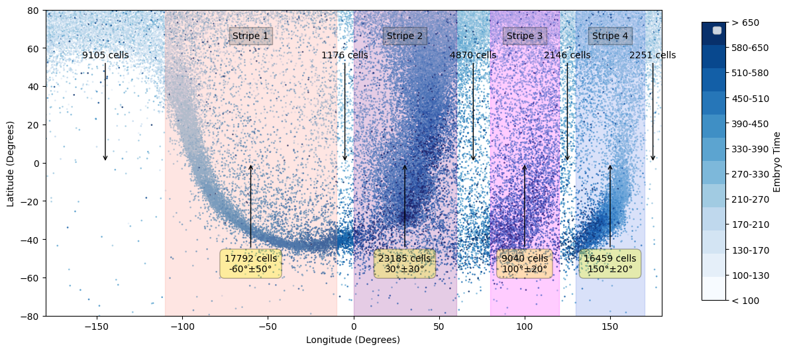
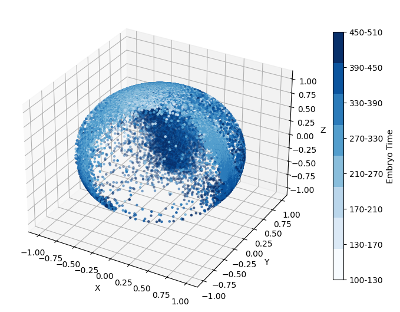
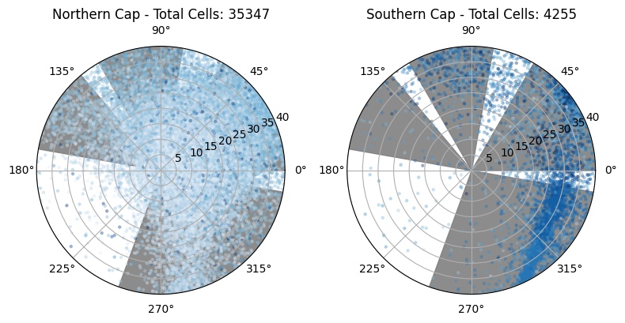
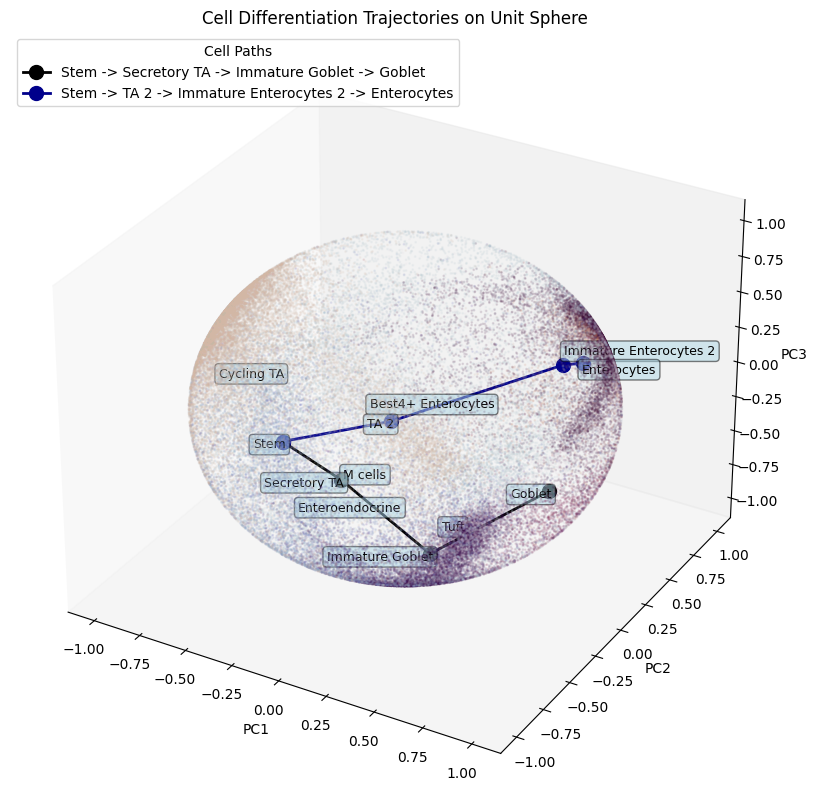
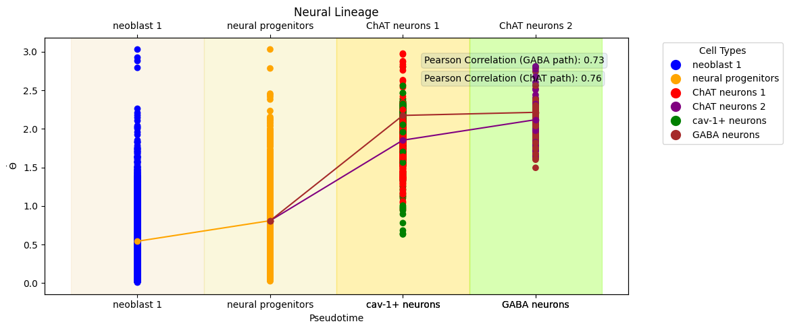
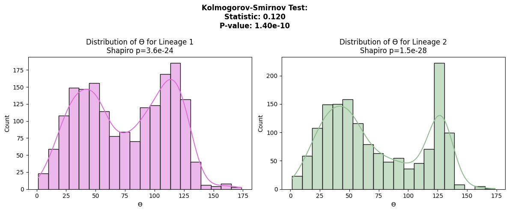

# PCA Sphere Projection

PCA Sphere Projection is a Python package designed to visualize and analyze single-cell gene expression data projected onto a 3D unit sphere.

---

## Features

- Align PCA-projected data to biological root nodes on a 3D unit sphere.
- Perform Euler rotations to refine visualization.
- Create equirectangular projections for 2D mapping.
- Correlate gene expression with pseudotime trajectories.
- Conduct statistical analysis of pseudotime data across lineages.

---

## Installation

Install the package directly from GitHub:

```bash
pip install git+https://github.com/imlong4real/pca_sphere_projection.git
```

---

## Example Usage

### 1. Alignment to the North Pole
Align your PCA-projected data to the north pole using a biological root node.

```python
import pandas as pd
import pca_sphere_projection.core as pc

# Load your dataset, which should contain the first three principal components and a column storing cell-type information
data = pd.read_csv('your_file.csv')

# Align data to the north pole
centroid = data[data['celltype'] == 'root_node'][['PC1', 'PC2', 'PC3']].mean().values
data = pc.align_to_north_pole(data, pcs_columns=['PC1', 'PC2', 'PC3'], cluster_column='cluster', root_node=centroid)
```

---

### 2. Fine-Tuning with Euler Rotations
Adjust the projection using Euler rotations.

```python
data = pc.apply_euler_rotation(
    data, 
    pcs_columns=['PC1', 'PC2', 'PC3'], 
    rotation_angles=[-90, -50, 50], 
    degrees=True
)
```

---

### 3. Equirectangular Projection
Visualize your data in 2D using an equirectangular projection.

```python
pc.equirectangular_projection(
    data, 
    pcs_columns=['rotated_PC1', 'rotated_PC2', 'rotated_PC3'], 
    cluster_column='celltype', 
    categories=None, 
    selected_celltypes=None, 
    colormap='magma', 
    figsize=(10, 8), 
    point_size=1, 
    alpha=0.7, 
    xlim=(-180, 180), 
    ylim=(-80, 80)
)
```

#### Example Output:


---

### 4. 3D Globe Visualization
Visualize the data on a 3D sphere (static or interactive).

```python
pc.visualize_globe(
    data, 
    pcs_columns=['rotated_PC1', 'rotated_PC2', 'rotated_PC3'], 
    cluster_column='celltype', 
    colormap='magma', 
    point_size=0.5, 
    interactive=False, 
    output_html=None, 
    figsize=(10, 10), 
    legend_columns=3
)
```

#### Example Output:
- **C. elegans Globe:**
  
- **Polar Regions:**
  
- **Human Colon Epithelial Stem Cell Development:**
  

---

### 5. Lineage Correlation and Statistical Testing
Analyze pseudotime trajectories and correlate sublineages inferred by other tools (e.g., PAGA). Optionally, perform statistical tests between lineages.

#### Visualize Correlation:
```python
pc.visualize_lineage_correlation(
    data, 
    cell_types_lineage1=['neoblast 1', 'gut progenitors', 'phagocytes'], 
    cell_types_lineage2=None, 
    pcs_columns=['rotated_PC1', 'rotated_PC2', 'rotated_PC3'], 
    cluster_column='celltype', 
    colormap='viridis', 
    figsize=(5, 3), 
    annotate=True
)
```

#### Perform Statistical Tests:
```python
pc.statistical_test_on_lineages(
    data, 
    lineage1=['neural progenitors', 'ChAT neurons 1', 'ChAT neurons 2'], 
    lineage2=['neural progenitors', 'cav-1+ neurons', 'GABA neurons'], 
    pcs_columns=['rotated_PC1', 'rotated_PC2', 'rotated_PC3'], 
    cluster_column='celltype', 
    figsize=(12, 5)
)
```

#### Example Output:
- **Planaria Lineage Correlation:**
  
- **Statistical Test Result:**
  

---

## Reproducibility

To reproduce these results or apply the package to your own data, see the example Jupyter notebooks in the `examples/` folder:

- [Benchmark Analysis](examples/benchmark.ipynb)
- [C. elegans Stripe Visualization](examples/celegan.ipynb)
- [Planaria Developmental Trajectories](examples/planaria.ipynb)

---

## License

This project is licensed under the MIT License. See the [LICENSE](LICENSE) file for details.
