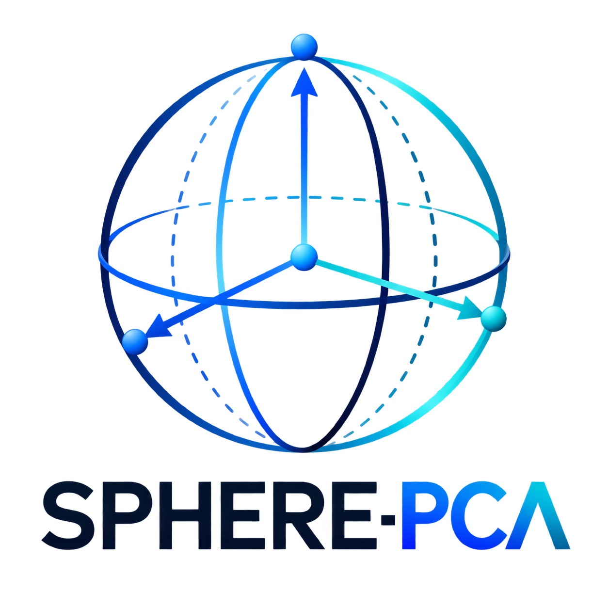

<div align="center">
  
  <h1>SPHERE-PCA</h1>
  <p><strong>Interpretable spherical coordinates for single-cell state transitions from principal components.</strong></p>

  <p>
    <a href="https://pypi.org/project/sphere-pca/"></a>
    <a href="https://doi.org/10.64898/2026.09.11.751061"></a>
    <a href="https://github.com/imlong4real/SPHERE-PCA/actions/workflows/tests.yml"></a>
    <a href="https://github.com/imlong4real/SPHERE-PCA/blob/main/LICENSE"></a>
    
    <a href="https://academic.oup.com/jimmunol/article/214/Supplement_1/vkaf283.978/8332132"></a>
  </p>
</div>

## What is SPHERE-PCA?

SPHERE-PCA L2-normalizes PC1-PC3 onto the unit sphere, rotates a biologically
defined root population to the north pole, and returns three transparent
coordinates for every cell. It is deterministic, preserves the original PCA
loadings, and can start from either existing PC coordinates or a normalized
cell-by-gene matrix.

SPHERE-PCA is a geometric description—not automatic evidence of a causal
trajectory, developmental direction, or experimental perturbation response.
Root choice and coordinate interpretations should be validated independently.

## Installation

Install the latest release from PyPI:

```bash
python -m pip install sphere-pca
```

To include the plotting helpers:

```bash
python -m pip install "sphere-pca[plot]"
```

For local development or manuscript reproduction:

```bash
git clone https://github.com/imlong4real/SPHERE-PCA.git
cd SPHERE-PCA
python -m pip install -e ".[dev]"
```

Optional extras are `plot`, `singlecell`, `app`, `manuscript`, and `dev`. The
core install contains only NumPy and scikit-learn. The preserved historical
namespace is available through the `legacy` extra; the dashboard uses `app`:

```bash
python -m pip install "sphere-pca[app]"
sphere-trace
```

The installed dashboard includes a small synthetic example and accepts CSV
uploads. Large manuscript datasets are not included in the distribution.

## Quick start

Transform existing PC1-PC3 coordinates:

```python
import sphere_pca

result = sphere_pca.transform(pcs, root_mask=is_stem_cell)

# Or reuse an explicitly recorded centroid in PC1-PC3 coordinates:
result = sphere_pca.transform(pcs, root_centroid=published_centroid)

result.theta
result.phi
result.r
sphere_pca.plot(result, color=cell_type)
```

Use an `AnnData` object with `adata.obsm["X_pca"]` (or pass `use_rep=None` to
fit PCA from `adata.X`):

```python
result = sphere_pca.fit(
    adata,
    root="stem_cell",
    root_key="cell_type",
    write_back=True,
)
```

This writes `sphere_pca_theta`, `sphere_pca_phi`, and `sphere_pca_r` to
`adata.obs` and aligned unit vectors to `adata.obsm["X_sphere_pca"]`.
`fit()` does not normalize counts, log-transform, select highly variable
genes, or scale features. Supply an existing PCA representation for exact
workflow control, or perform the required preprocessing before fitting PCA.

## What the coordinates mean

| Coordinate | Meaning |
|---|---|
| **θ** | Root-aligned geodesic progression: angular distance from the chosen root direction. |
| **φ** | Angular state or branch position around the root-aligned sphere. |
| **r** | Pre-projection radial magnitude in PC1-PC3 space; it is retained, not normalized away. |

Angles are returned in radians. A structured coordinate can be biologically
useful without being causal; compare it with sampling time, lineage labels,
known markers, perturbations, or other independent evidence.

## Tutorials / examples

Two download-free tutorials live in [`examples/`](examples/README.md):

- [`existing_pca.py`](examples/existing_pca.py) — transform and visualize a
  tiny synthetic PC1-PC3 matrix.
- [`anndata_workflow.py`](examples/anndata_workflow.py) — fit from AnnData,
  define a root population, and write coordinates back to `adata.obs`.

## Reproducing the paper

The published analysis namespace remains available as
`pca_sphere_projection`; its numerical implementation has not been replaced by
the new public wrapper. The public API uses a proper orthogonal Rodrigues
rotation, while the frozen Figure 1 pathway retains its original implementation
for reproduction and can therefore produce different numerical coordinates.
Manuscript entry points and expected inputs are documented in
[`scripts/manuscript/`](scripts/manuscript/README.md).

```bash
python -m pip install -r requirements-manuscript.txt
python scripts/manuscript/make_manuscript_figures.py --figure 1
```

Large source datasets and generated outputs are intentionally excluded from
the Python distribution. Follow the preprint's data-access instructions and
place inputs under `raw_data/` before running the figure workflows.

## Citation

If you use SPHERE-PCA, please cite:

> Yuan L, Li X, Le M, Hicks SC, Deshpande A, Taube JM, Szalay AS.
> *Interpretable spherical geometry of single-cell state transitions from dominant principal components.*
> bioRxiv (2026). <https://doi.org/10.64898/2026.09.11.751061>

Machine-readable metadata is available in [`CITATION.cff`](CITATION.cff).

## License

SPHERE-PCA is released under the [MIT License](LICENSE).
